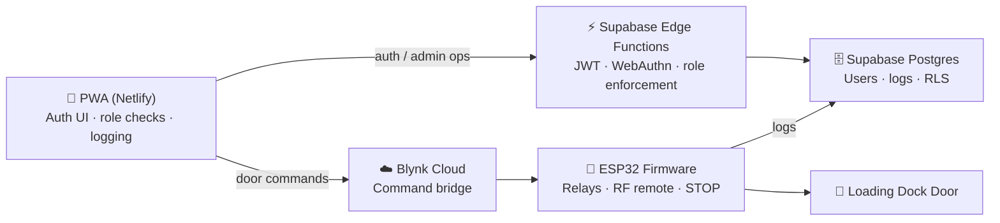

# DoorCTL — Warehouse Door Control System

A full-stack IoT system for controlling warehouse loading-dock doors remotely, from a mobile web app or a physical RF remote — with a security model designed so that **only authenticated, authorized users can operate the doors or manage the system**.

Built and deployed as a working pilot on a live loading dock, with an architecture that scales to multiple doors.

**🔗 Live demo (fully interactive, simulated data):** https://doorctl-demo.netlify.app
**🔧 Full hardware build, wiring diagrams & photos:** _Hackster.io write-up — link coming soon_

> The live demo runs entirely in the browser with mock data — doors animate but control no real hardware. Sign in with `admin / demo123` (or `operator` / `viewer`, same password) to explore each role.

---

## Overview

Warehouse staff open and close loading-dock doors from their phones through an installable PWA, or from a handheld 433 MHz remote. Every action is authenticated, role-checked, and logged. The system was built to close a specific gap: making sure that a public-facing web app could never be used by an unauthorized person — or an under-privileged one — to operate the doors or read sensitive data.

---

## Architecture

Four layers, each with a single clear responsibility:



- **PWA (frontend)** — installable web app hosted on Netlify. Handles login, biometric auth, the door UI, activity history, and user management.
- **Supabase Edge Functions (auth backend)** — Deno/TypeScript functions that issue and verify tokens, run the WebAuthn challenge-response flow, and enforce roles on every privileged request.
- **Supabase Postgres + RLS** — stores users, roles, schedules, and logs. Sensitive tables are never queried directly from the browser; all privileged access goes through Edge Functions using the service-role key.
- **ESP32 firmware** — drives the relays, listens to the physical STOP button and the 433 MHz remote, and writes connection logs directly to Supabase.

Blynk Cloud is used purely as a lightweight command bridge between the app and the microcontroller.

---

## Security

Security is the core of this project, not an afterthought. The web app ships a public Supabase key by design (as intended for Supabase's publishable keys), so that key alone can never be enough to perform a privileged action.

- **JWT-based authorization** — on login, the server issues a 30-day HMAC-SHA256 token signed with a secret that lives only on the server. Tokens are minted and verified with the Web Crypto API (no external JWT dependency). Every admin request must carry a valid token.

- **WebAuthn biometric login** — fingerprint / Face ID login uses a real challenge-response flow. The credential's public key is registered and stored server-side; each login verifies a signature against it (`@simplewebauthn/server`). The private key never leaves the device, so biometric login cannot be spoofed by replaying a username.

- **Server-side role enforcement** — the three privileged endpoints (read password, manage users, delete logs) re-check the caller's role **directly from the database on every call**, rather than trusting the role baked into the token. A downgrade takes effect immediately, without waiting for the token to expire.

- **RLS + Edge Function pattern** — the browser never reads sensitive data directly. Row-Level Security protects the tables, and all sensitive operations are funneled through Edge Functions that hold the service-role key.

- **Three-tier roles** — `admin`, `operator`, and `read_only`, applied consistently across the UI, the door controls, and the backend.

---

## Features

- Remote door control (open / close / stop) from any mobile browser
- Installable PWA — works like a native app, offline-aware shell
- Biometric login (fingerprint / Face ID) via WebAuthn
- Role-based access: `admin` / `operator` / `read_only`
- Per-user access schedules (allowed hours and days)
- Activity log with timestamps, grouped by week
- Live ESP32 connection status and connection history
- Physical 433 MHz remote operating in parallel with the app
- Physical STOP button wired directly to the microcontroller

---

## Tech Stack

**Hardware**
- ESP32 microcontroller
- 2-channel relay module (Active HIGH)
- QIACHIP RX480E 433 MHz RF receiver + YK04 remote
- Physical STOP button

**Firmware**
- Arduino framework (C++), WiFiMulti, ArduinoOTA, NTP
- Blynk (command bridge), HTTP logging to Supabase

**Backend**
- Supabase — Postgres, Row-Level Security, Edge Functions (Deno / TypeScript)
- JWT (HMAC-SHA256, Web Crypto), WebAuthn (`@simplewebauthn/server`)

**Frontend**
- Vanilla JS PWA (no framework), hosted on Netlify

---

## Repository Structure

```
doorctl-system/
├── firmware/
│   ├── warehouse-door-1.ino     # ESP32 firmware (Door 1)
│   └── config.example.h         # Firmware config template
└── pwa/
    ├── index.html               # The full progressive web app
    └── config.example.js        # PWA config template
```

> Real credentials live in `config.h` / `config.js`, which are gitignored and never committed. Copy the `.example` files, fill in your own values, and keep them local.

---

## Getting Started

**Firmware**
1. Copy `firmware/config.example.h` → `config.h` and fill in your Blynk token, WiFi networks, Supabase URL/key, and OTA password.
2. Flash `warehouse-door-1.ino` to an ESP32 (Arduino IDE).

**PWA**
1. Copy `pwa/config.example.js` → `config.js` and fill in your Supabase URL/key and Blynk door tokens.
2. Serve the `pwa/` folder (e.g. deploy to Netlify).

**Backend**
- Create a Supabase project, add the `users` and `logs` tables with RLS, and deploy the Edge Function that handles login, WebAuthn, and the admin endpoints.

---

## Hardware Overview

| GPIO | Function |
|------|----------|
| 26   | OPEN relay (Active HIGH) |
| 27   | CLOSE relay (Active HIGH) |
| 25   | Physical STOP button |
| 32   | Remote OPEN |
| 33   | Remote CLOSE |
| 14   | Remote STOP |

Full wiring diagrams, schematics, and build photos will be published in the Hackster.io write-up.

---

## Roadmap

- Scale from the Door 1 pilot to multiple doors (each door = its own ESP32 + firmware copy; PWA already supports up to four)
- Make the OTA hostname door-specific when additional doors come online
- Bypass-detection: reconcile firmware-reported signals against app logs to flag any unverified door activity

---

## Status

🔧 **Pilot** — running on one loading-dock door, with an architecture designed to scale to multiple doors.

---

_Built by [nlatsabidze-hw](https://github.com/nlatsabidze-hw)._
